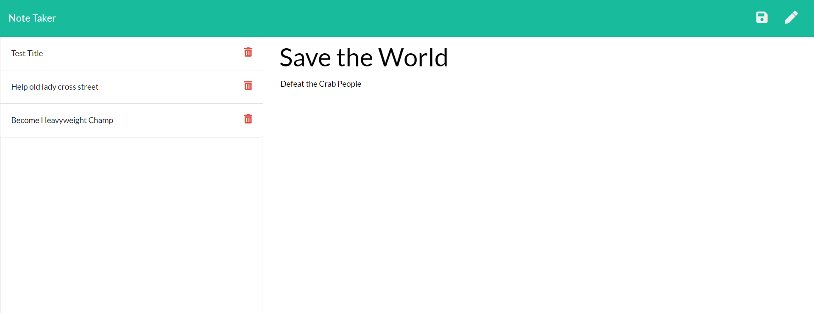

# Note Taker

### GitHub Username: [antnio36alv](https://github.com/antonio36alv)

[GitHub Repo](https://github.com/antonio36alv/note-taker)

[Video Demo](https://drive.google.com/file/d/17JgkGFMLRRkSXnAaGVfejVQd2rSc9mpQ/view)

## Project Description

With the given front-end I was tasked with the job of developing a backend that would be responsible for getting, posting, and deleting notes. This is mainly done through node.js and express.

## Table of Contents
[Installion](#installion)

[Usage](#usage)

[Tests](#tests)

## Installion
Requires : NodeJS, express package, UUIDv4 package

## Usage
Great for making notes on the fly!

## Future Deployments
A great implementation would be a way to add users that way this web app could be used by several people.